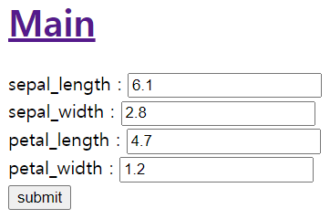
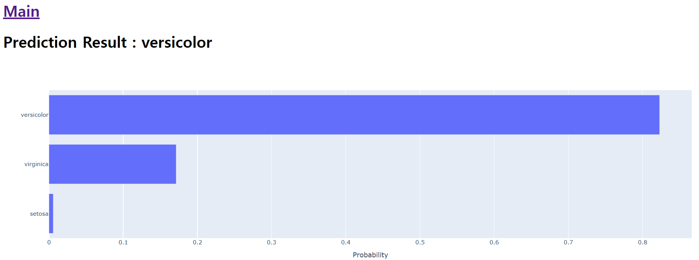

# Flask

> python web framework
>
> predict iris species using tensorflow model

 

 

 

 

## Demo

> input : sepal_length, sepal_width, petal_length, petal_width
>
> output : predict class & probability plot

 

- input (/)

 

 

- output (/result)

 

 

 

 

## Directory Structure

- flask
  - files
    - iris_model.h5 # model
    - label_info.pickle # target information
    - standard_scaler.pickle # scaler
  - templates
    - base.html
    - index.html
    - result.html
  - main.py