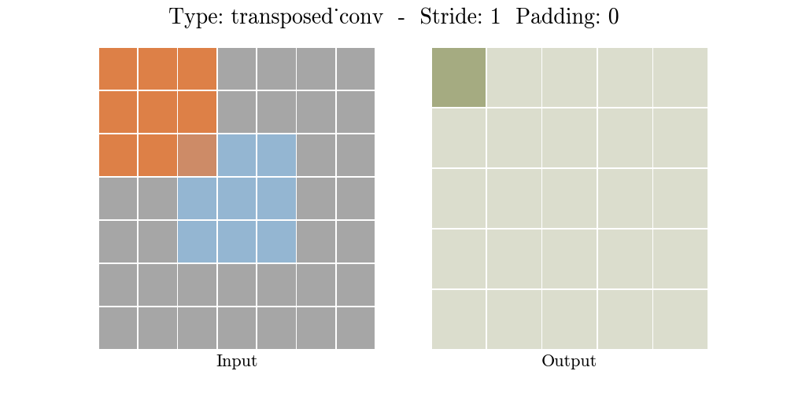
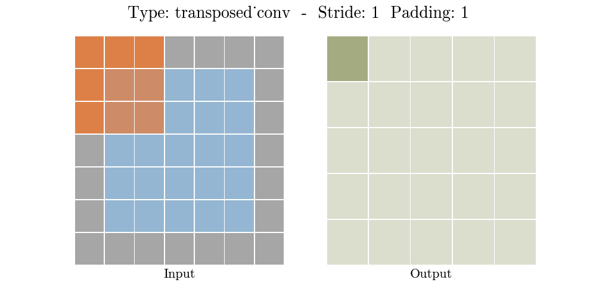
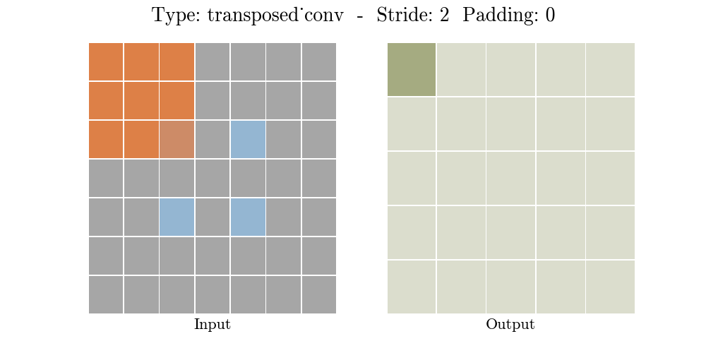

# Transposed Convolutional Layer

> convolutional layer와 반대로 upsampling (역연산 x)
>
> input shape <= output shape
>
> input에 변형

 

 

## Parameters

- s : stride
- p : padding
- k : kernel size (3)

 

 

## Convolutional Layer

 

 

 

 

 

 

 

 

 

 

 

 

 

 

 

 

## Transposed Convolutional Layer

 

 

 

 

 

 

 

 

 

 

 

 

- Reference
  - https://github.com/aqeelanwar/conv_layers_animation